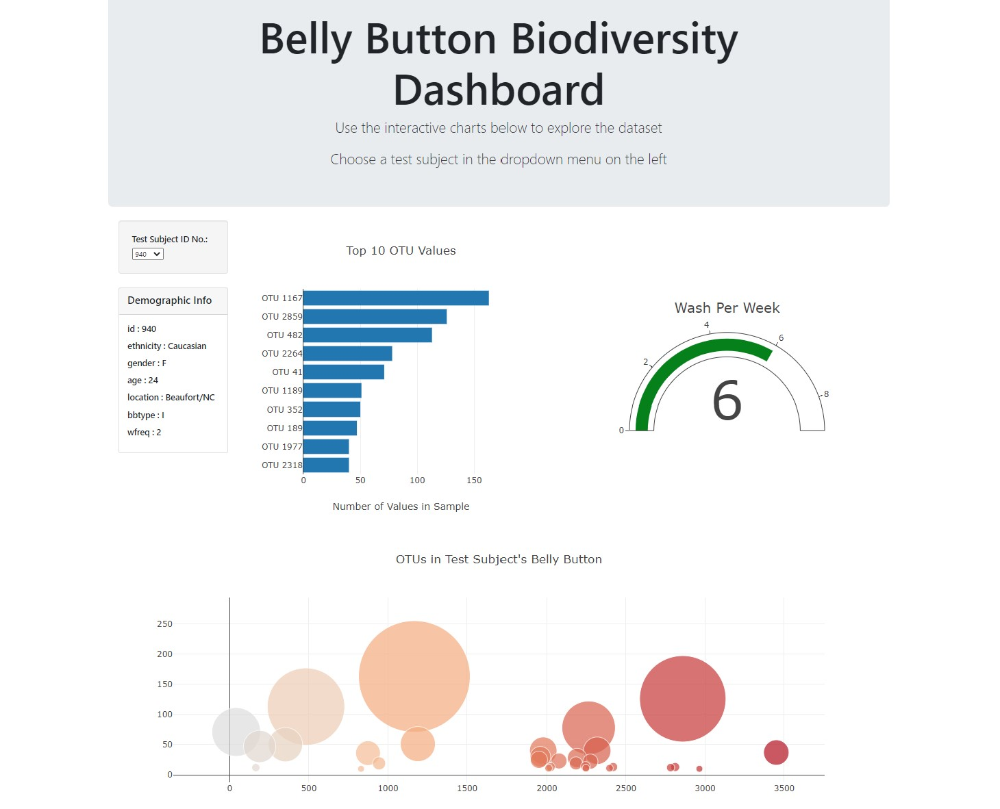

# Plotly - How to create an interactive dashboard
Javascript, D3.js, JSON, Plotly, Bootstrap4, HTML

## Live dashboard at: https://jaysueno.github.io/plotly-interactive-visualization-and-dashboard/

There's are four files that work in unison in this app: 
* HTML with the structure of the web dashboard 
* JSON Data file
* Javascript to manipulate the [Document Object Model](https://www.w3.org/TR/REC-DOM-Level-1/introduction.html) of the HTML

## Steps

1. Use the D3 library to read in `samples.json`.

2. Create a horizontal bar chart with a dropdown menu to display the top 10 OTUs found in that individual.
* Use `sample_values` as the values for the bar chart.
* Use `otu_ids` as the labels for the bar chart.
* Use `otu_labels` as the hovertext for the chart.

3. Create a bubble chart that displays each sample.
* Use `otu_ids` for the x values.
* Use `sample_values` for the y values.
* Use `sample_values` for the marker size.
* Use `otu_ids` for the marker colors.
* Use `otu_labels` for the text values.

4. Display the sample metadata, i.e., an individual's demographic information.

5. Display each key-value pair from the metadata JSON object somewhere on the page.

6. Create a gauge chart to plot the weekly washing frequency of the individual.
* Adapt the Gauge Chart from <https://plot.ly/javascript/gauge-charts/> to plot the weekly washing frequency of the individual.
* You will need to modify the example gauge code to account for values ranging from 0 through 9.

7. Update all of the plots any time that a new sample is selected.

## Deployment

* Deploy your app to a free static page hosting service, such as GitHub Pages. Submit the links to your deployment and your GitHub repo.

* Ensure your repository has regular commits (i.e. 20+ commits) and a thorough README.md file

### About the Data

Hulcr, J. et al.(2012) _A Jungle in There: Bacteria in Belly Buttons are Highly Diverse, but Predictable_. Retrieved from: [http://robdunnlab.com/projects/belly-button-biodiversity/results-and-data/](http://robdunnlab.com/projects/belly-button-biodiversity/results-and-data/)

### To learn more about Jay Sueno visit his [LinkedIn](https://www.linkedin.com/in/jay-sueno-359a274/)

##### All rights reserved 2020. All code is created and owned by Jay Sueno. If you use his code, please visit his LinkedIn and give him a a skill endorsement in python and data science. Visit him at: https://www.linkedin.com/in/jay-sueno-359a274/